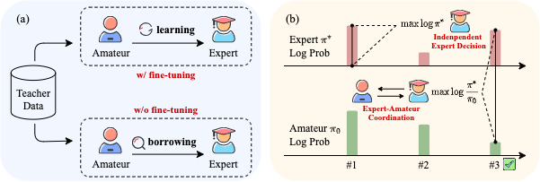
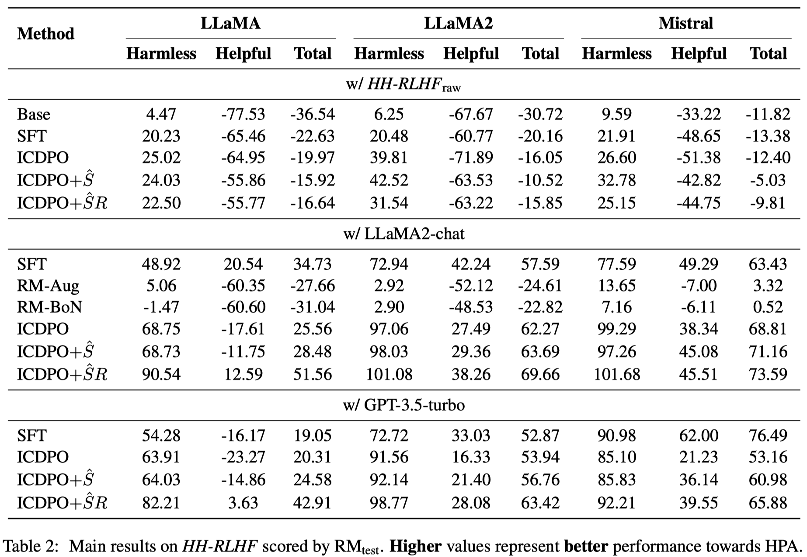
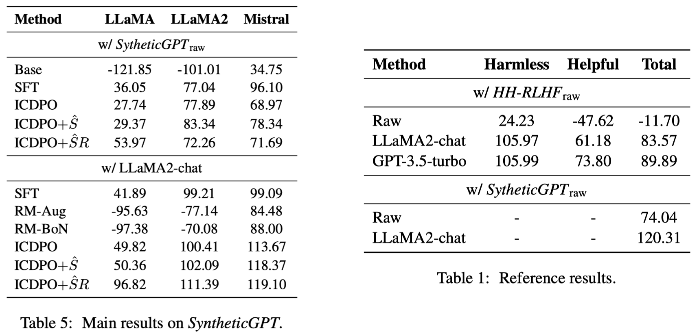
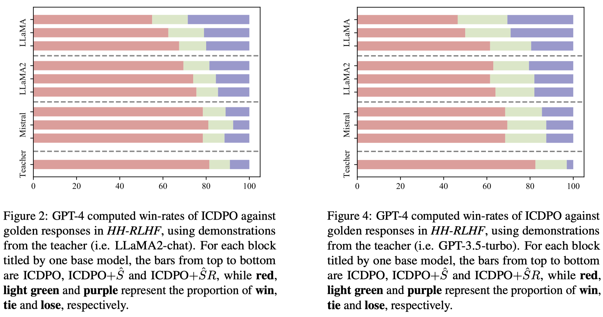

# ICDPO: Effectively Borrowing Alignment Capability of Others via In-context Direct Preference Optimization
Authors: Feifan Song, Yuxuan Fan, Xin Zhang, Peiyi Wang, Houfeng Wang

arXiv: [Abstract](https://arxiv.org/abs/2402.09320) / [PDF](https://arxiv.org/pdf/2402.09320.pdf)



Large Language Models (LLMs) rely on Human Preference Alignment (HPA) to ensure the generation of safe content. Due to the heavy cost associated with fine-tuning, fine-tuning-free methods have emerged, typically modifying LLM decoding with external auxiliary methods. However, these methods do not essentially enhance the LLM itself. In this paper, we rethink the derivation procedures of DPO, based on which we conversely build an instant scorer using the states of the LLM before and after In-context Learning (ICL). Accordingly, we propose a novel approach called In-Context Direct Preference Optimization (ICDPO). It enables LLMs to borrow the HPA capabilities from superior LLMs with ICL, generating well-aligned responses as estimated by the aforementioned instant scorer, thereby enhancing the final performance. ICDPO can be further enhanced with a two-stage retriever and an upgraded scorer, both offering benefits. Extensive experiments show its effectiveness, particularly in outperforming two fine-tuning-free baselines, and it exhibits competitiveness with SFT + LoRA. We also conduct detailed analyses to offer comprehensive insights into ICDPO.

## Results
### Main Results



### GPT-4 Evaluation


## Implementation
### Packages Requirement
```
python==3.9.13
torch==1.13.1
transformers==4.28.1
```

## Usage
We prepare a script `exec.sh` for easy start. Before using it, you need to first specify some parameters. Below is a sample:
```
script=hh
id=1
task=hh
pos_mode=icl
neg_mode=base
generator=llama
retrieval=random
model_name_or_path=YOUR_MODEL_PATH

sh scripts/sample_generate_${script}.sh $id $task $pos_mode $neg_mode $generator $retrieval $model_name_or_path
sh scripts/evaluate_${script}.sh $id $task
```
Then, just run the script:
```
sh exec.sh
```
You can further change the value of each slot and set another `id` to try different settings.

## Citation
If this work is helpful to you, welcome to cite our paper as:
```
@misc{song2024icdpo,
      title={ICDPO: Effectively Borrowing Alignment Capability of Others via In-context Direct Preference Optimization}, 
      author={Feifan Song and Yuxuan Fan and Xin Zhang and Peiyi Wang and Houfeng Wang},
      year={2024},
      eprint={2402.09320},
      archivePrefix={arXiv},
      primaryClass={cs.CL}
}
```